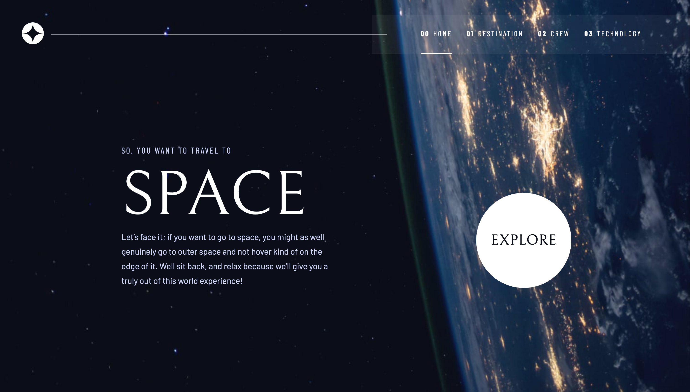
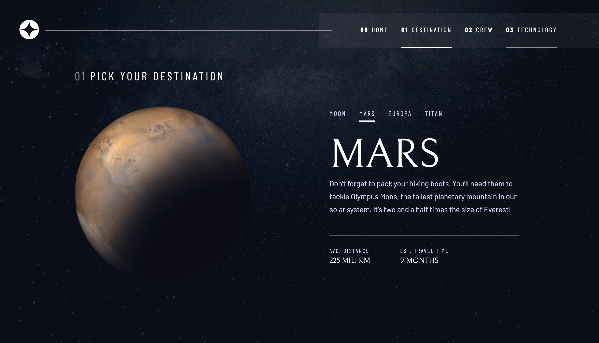
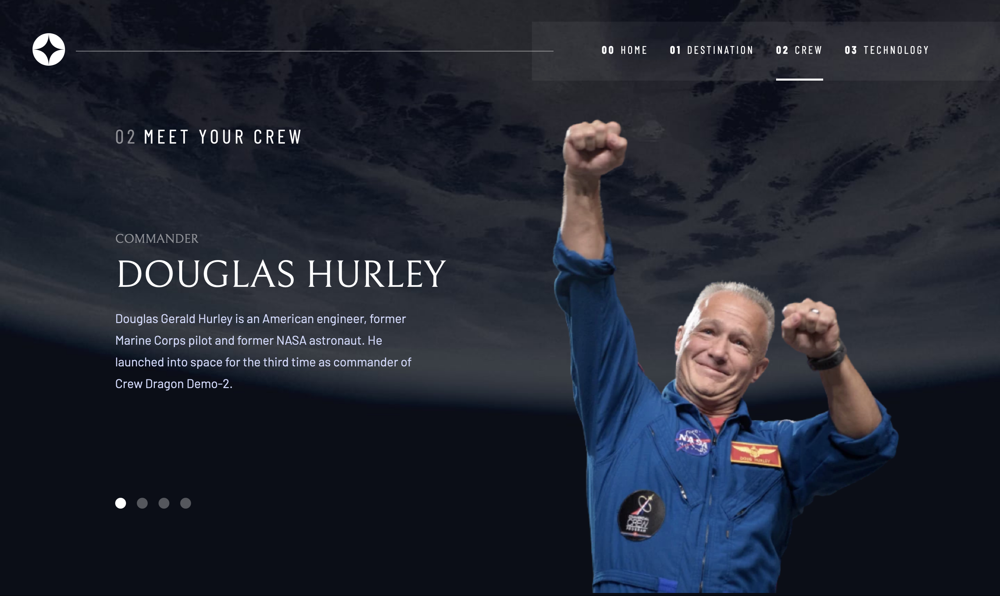
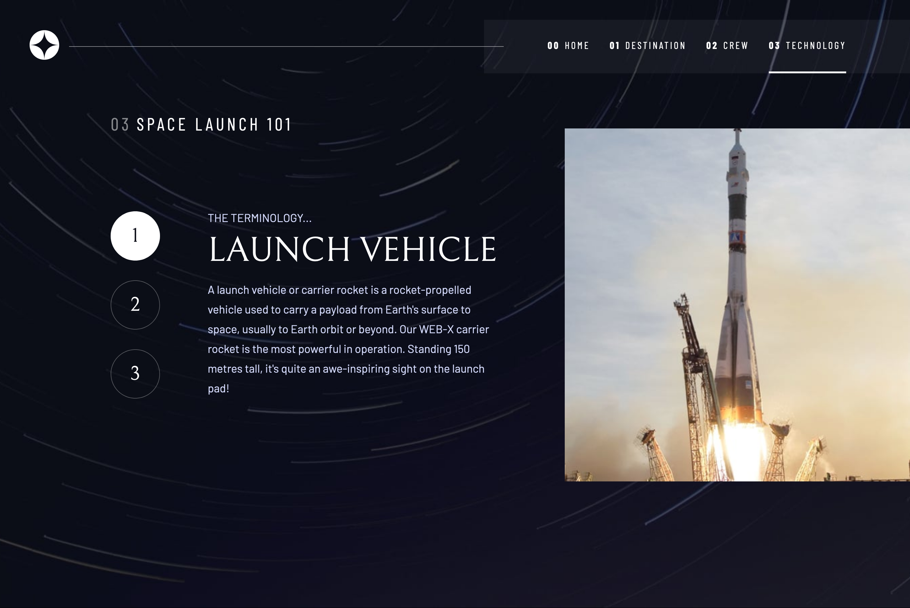
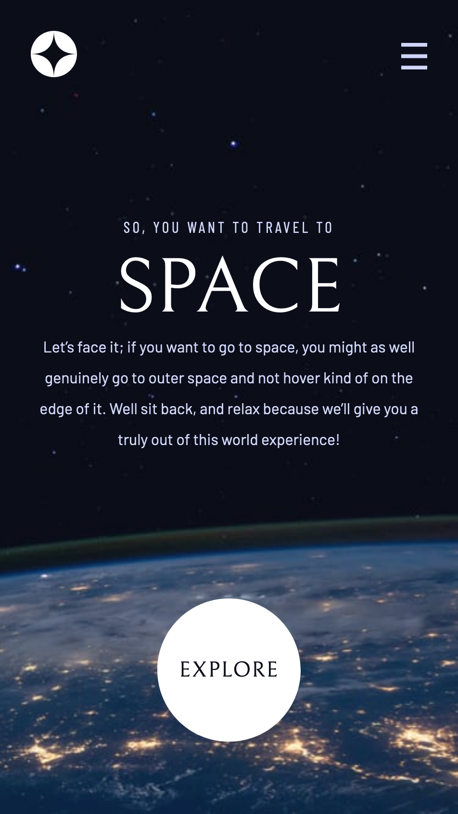
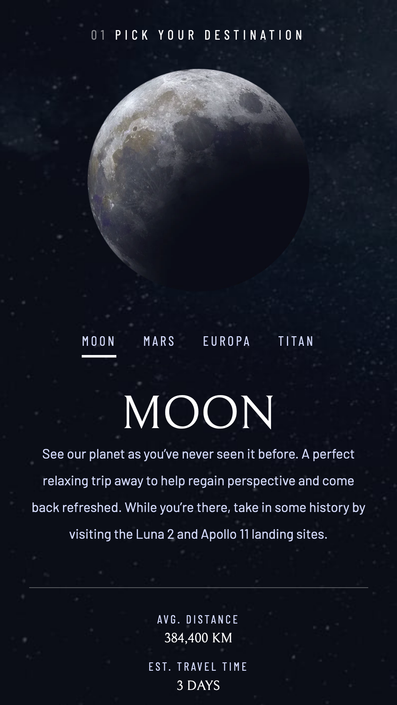
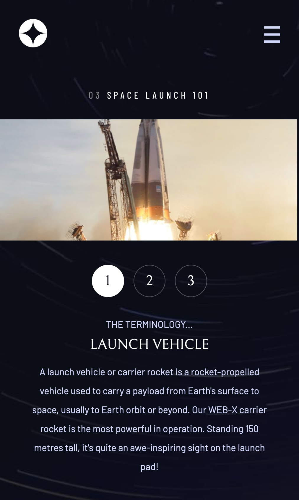
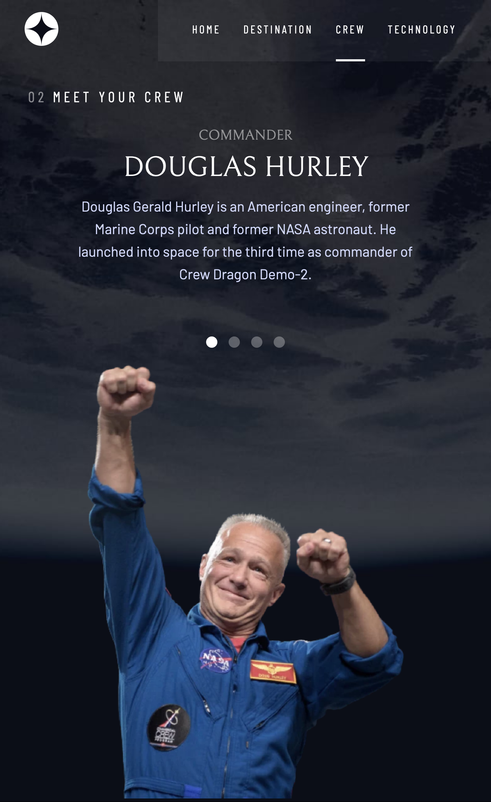

# Frontend Mentor - Space tourism website solution

This is a solution to the [Space tourism website challenge on Frontend Mentor](https://www.frontendmentor.io/challenges/space-tourism-multipage-website-gRWj1URZ3).

## Table of contents

- [Overview](#overview)
  - [Screenshot](#screenshot)
  - [Links](#links)
- [My process](#my-process)
  - [Built with](#built-with)
  - [What I learned](#what-i-learned)
  - [Useful resources](#useful-resources)
- [Author](#author)
- [Acknowledgments](#acknowledgments)

## Overview

### Screenshot

### Links

- Solution URL: [Solution URL](https://github.com/HassanMak29/frontend-mentor-space-tourism)
- Live Site URL: [Live site URL](https://frontend-mentor-space-tourism-hassan.netlify.app/)

### Built with

- Semantic HTML5 markup
- CSS custom properties
- Flexbox
- CSS Grid
- Mobile-first workflow
- [Vite](https://vite.dev/) - JS tool
- [PostCSS](https://postcss.org/) - For styles

### What I learned

I followed Kevin Powell's lesson on scrimbe, and learned how to create a design system and use reusable components and classes

### Useful resources

- [Example resource 1](https://scrimba.com/learn/spacetravel) - This helped me with creating a design system and resuse css classes. I really liked this pattern and will use it going forward.

## Author

- Website - [Abdelmounaim H. Makhloufi](https://www.makhloufi.me)
- Frontend Mentor - [@HassanMak29](https://www.frontendmentor.io/profile/HassanMak29)

## Acknowledgments

Great thanks to Kevin Powel for his free course on Scrimba about this challenge.
